# AutoScalling Oracle Cloud

# Konfigurasi Instance
1. Pada halaman detail instance, klik menu More Actions dan pilih Create Instance Configuration.
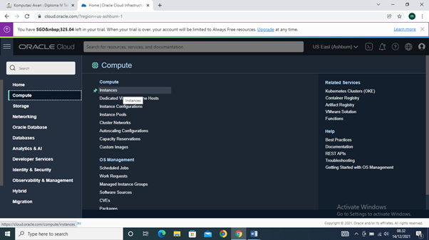
2. Pilih kompartemen Anda.
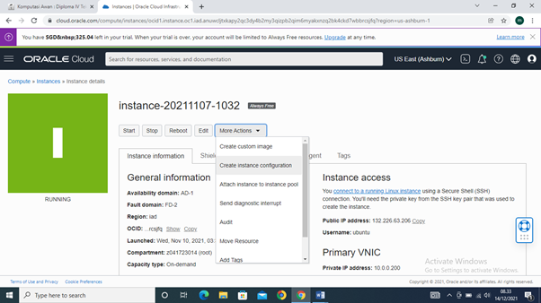
3. Untuk nama, masukkan instance-config.
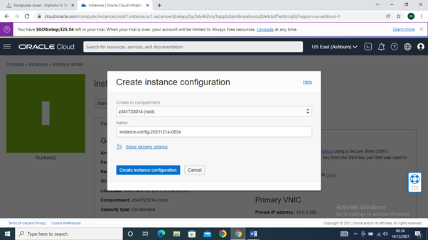
4. Click Create Instance Configuration.

# Instance Pool
1.	klik Create Instance pool
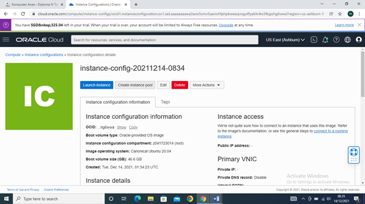
2.	Dari daftar Kompartemen, pilih kompartemen tempat Anda membuat konfigurasi instans.
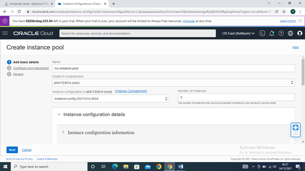
3.	Untuk nama, masukkan my-instance-pool.
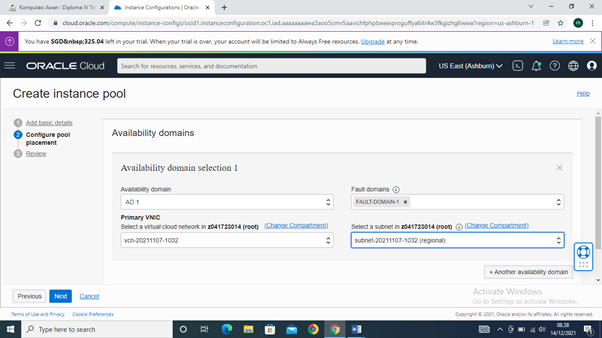
4.	Dari daftar Konfigurasi Instance, pilih instance-config.
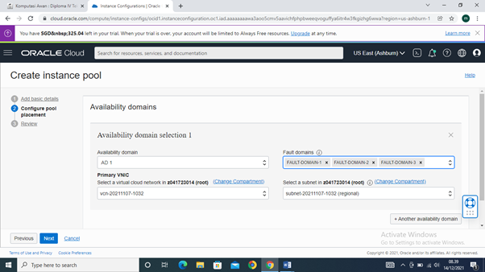
5.	Untuk number of instans, masukkan 3. Jumlah instans menunjukkan jumlah maksimum instans yang dapat disediakan di kolam instans. Jumlah instans yang dapat disediakan bergantung pada batas layanan penyewa Anda dan ketersediaan bentuk komputasi di wilayah Anda.
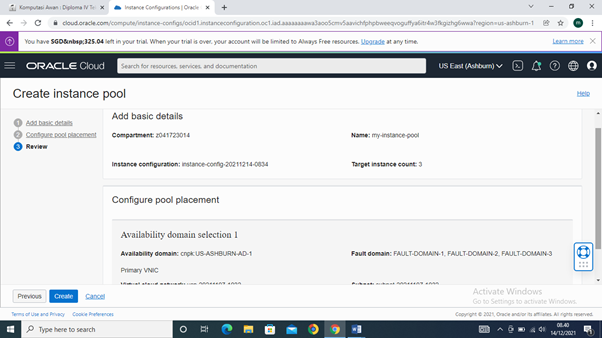
6.	Klik next
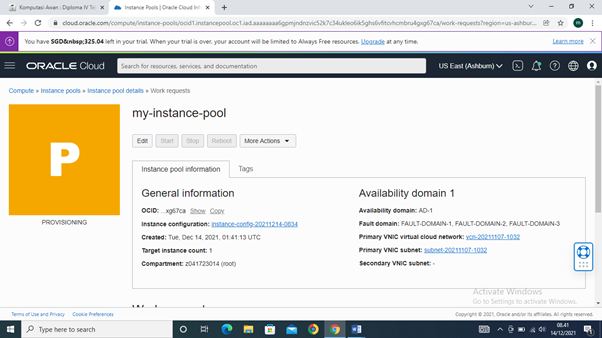

# konfigurasi Autoscalling
1.	Klik menu More Actions dan pilih Create Autoscaling Configuration.
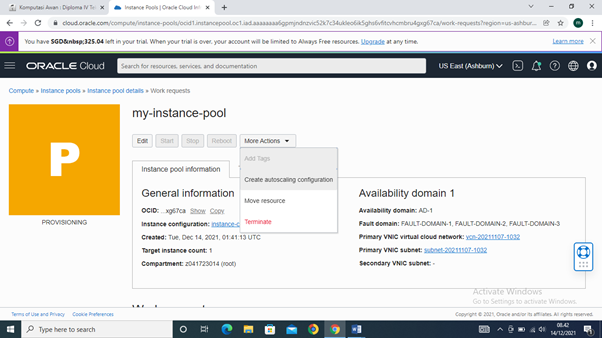
2.	Untuk nama, masukkan my-autoscaling-config.
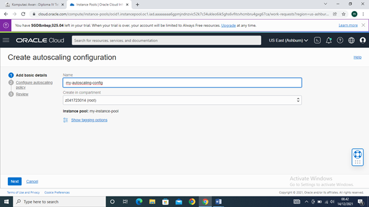
3.	Dari daftar Buat di kompartemen, pilih kompartemen tempat Anda membuat kumpulan instans.
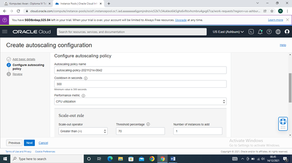
4.	Klik Next.
5.	Setelah Anda mengonfigurasi Autoscalling policy, klik Create. Anda dapat menentukan beberapa konfigurasi penskalaan otomatis untuk kumpulan instance yang sama, dan Anda dapat mengaktifkan atau menonaktifkannya salah satunya.
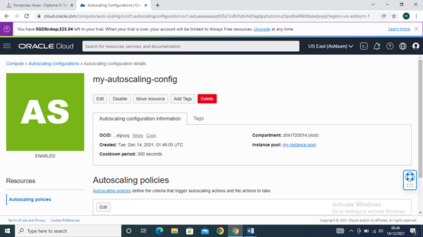
