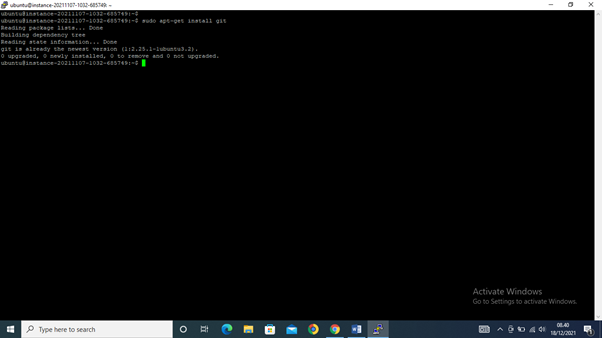

### CICD

##### Praktikum 

##### Hosting Static Website Menggunakan CI/CD Pipeline
1. Menyiapkan Bucket Object Storage
* Masuk ke akun https://cloud.oracle.com dan navigasi ke menu Storage -> Buckets

* . Tekan tombol Create Bucket, dan lengkapi Bucket Name dengan os-react. Biarkan nilai
lainnya dengan nilai default kemudian tekan tombol Create
* Ubah visibility bucket dengan menekan tombol Edit Visibility, dan ubah menjadi public.
Tekan tombol Save Changes untuk menyimpan perubaha
* Pada dashboard bucket, perhatikan nilai Namespace. Nilai ini nanti akan digunakan untuk
pengaturan deployment
2. Menyiapkan Project 
* Pada praktikum ini, akan digunakan React sehingga harus diinstall terlebih dahulu Node.
Untuk langkah instalasi Node silahkan gunakan tautan berikut sebagai referensi
https://nodejs.org/en/download/ atau https://nodejs.org/en/download/package-manager/
* Setelah Node terinstall, silahkan lakukan Langkah generate project dengan menggunakan
perintah berikut.
npx create-react-app os-react
* Buatlah repository pada GitHub kemudian push project tersebut ke dalam repository
3. Menambahkan GitHub Workflow
* Pipeline CI/CD pada GitHub dibuat dengan format yaml dan diletakkan pada lokasi
.github/workflows. Buatlah file yaml pada lokasi tersebut, sebagai ilustrasi silahkan
perhatikan filename berikut
.github/workflows/build.yml
* Salin konfigurasi pipeline berikut. 
* Pada pengaturan pipeline, terdapat nilai secrets yang diatur melalui pengaturan pada
repository GitHub.
* Buka alamat repository GitHub, dan masuk ke menu Settings -> Secrets
* Sebagai panduan, silahkan gunakan table berikut untuk pengisian secrets
* Lengkapi nilai semua secrets yang dibutuhkan. Kemudian push perubahan ke repository
GitHub
* Perhatikan tab Actions pada halaman repository. Cek hasil proses deployment apakah
terdapat kesalahan. Jika terjadi kesalahan, koreksi kembali nilai secrets yang dimasukkan.
* Jika proses deployment sudah mendapatkan tanda centang hijau, silahkan kembali ke
dashboard bucket object storage. Centang berkas index.html, kemudian tekan menu titik
tiga dan pilih View Object Details. Perhatikan URL Path dengan pola sebagai berikut
https://objectstorage.<region>.oraclecloud.com/n/<namespace>/b/<bucketname>/o/index.html.
* Salin URL Path tanpa nilai index.html, kemudian buka kembali project React. Cari berkas
package.json dan tambahkan key “homepage” dengan nilai URL Path pada Object
Details. Ilustrasi berkas hasil akhir package.json dapat dilihat sebagai berikut.
* Jika mengalami kesulitan, silahkan gunakan repository
https://github.com/dhanifudin/hello-react sebagai rujukan.
4. 
5. 
6. 