#Jobsheet 3

1. Login ke akun Oracle Cloud 
2. setelah berhasil login selanjutnya kita di arahkan ke halaman dashboard pilih menu di pojok kiri atas pilih Compute -> instance
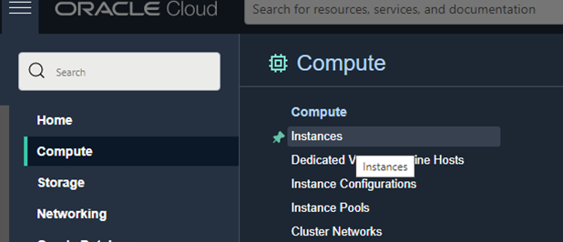
3. Pilih Create instance untuk membuat VM baru. Pada gambar berikut akan tampil nama,
status, dll terkait VM yang pernah kita buat. Jika belum ada, berarti VM belum pernah dibuat.
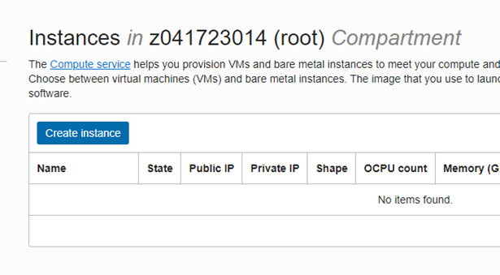
4. beri nama VM sesuai dengan keinginan. Misalnya di sini vm-ubuntu. Untuk
compartment biarkan secara default dan placement pastikan Always Free-eligible (biasanya secara
default sudah terpilih, jadi tidak perlu diatur lagi)
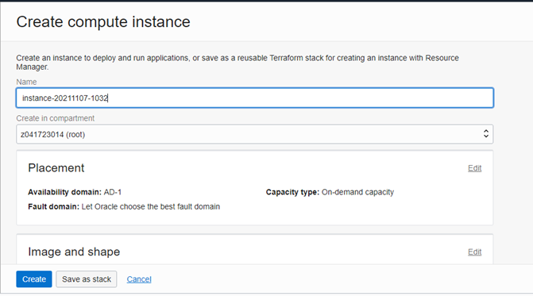
5. Pada bagian Image and shape silakan atur sistem operasi yang akan kita gunakan, ubah
menjadi Ubuntu dengan cara klik Edit. Untuk bagian shape biarkan saja, secara default biasanya
menggunakan AMD VM.Standard.E2.1.Micro Always Free-eligible dengan 1 core CPU dan 1 GB
RAM.
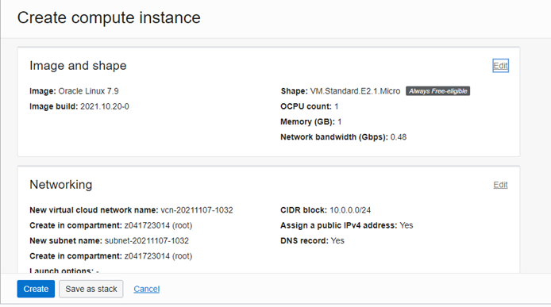
* Lakukan perubahan sistem operasi dengan klik Change image.
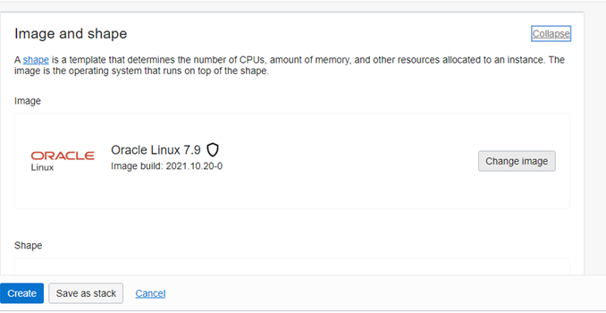
* Pilih Canonical Ubuntu versi 20.04, lalu klik Select image
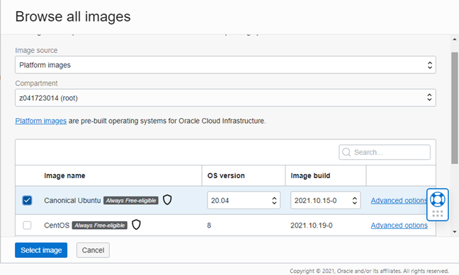
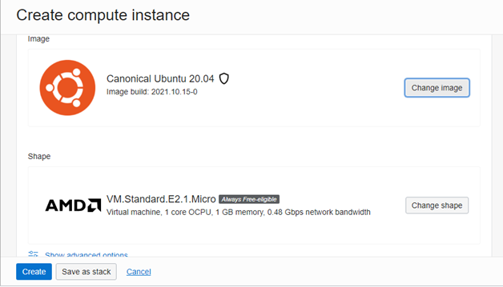
6. Pada bagian Networking biarkan saja pengaturannya. VCN akan dibahas lebih lanjut pada
pertemuan berikutnya. Secara default, akses SSH port 21 sudah bisa diakses.
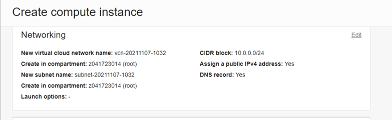
* Selanjutnya bagian SSH keys, kita perlu klik Save Private Key untuk mengunduh private key milik
kita agar nanti VM bisa diakses.
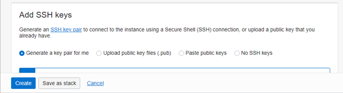
7. Untuk kapasitas disk bisa kita atur sesuai kebutuhan, namun di sini biarkan secara default
seperti pada gambar berikut, yaitu disk bervolume 46.6 GB. Langkah terakhir klik Create di pojok
kiri bawah untuk memulai membuat VM.
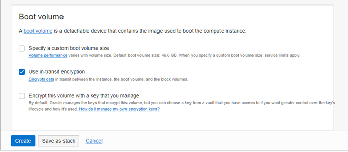
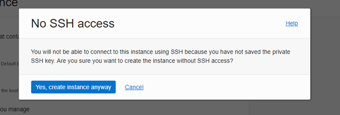
* Tunggu prosesnya sekitar 2-5 menit sampai tampil status state VM kita adalah running
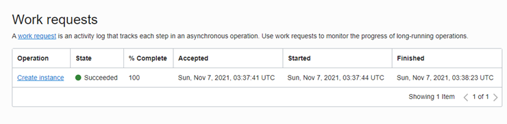

