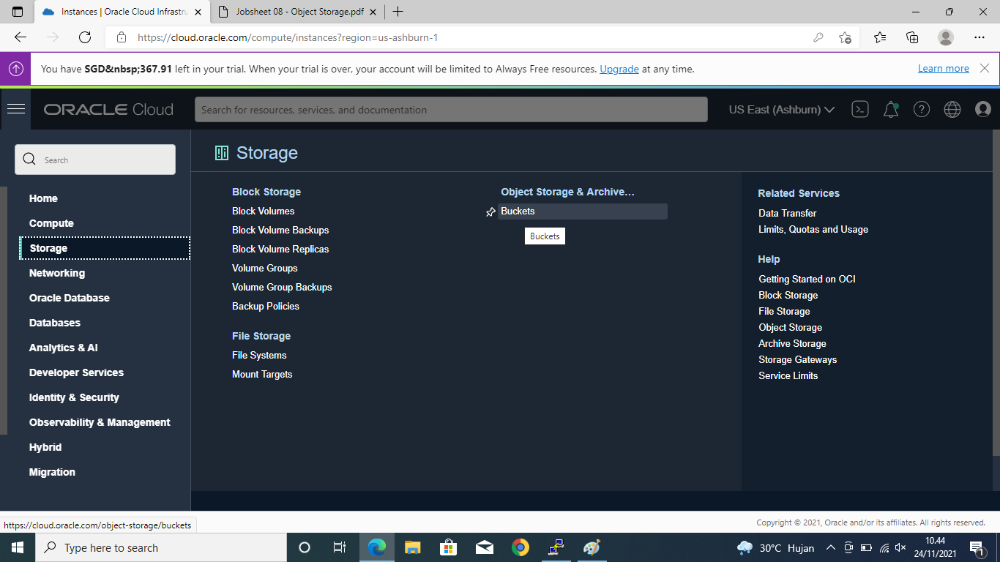
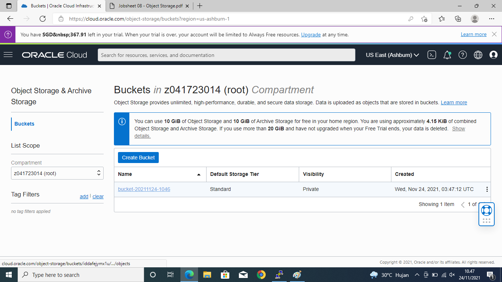

## Object Storage

##### Praktikum

1. Membuat bucket untuk website. Sign-in ke OCI kemudian pilih Object Storage.

* Create Bucket Pilih standar bucket

* Isikan Nama Bucket

* Bucket Berhasil di buat

* Buka bucket dengan melakukan klik pada nama bucket kemudian pilih Edit Visibility. 

Rubah Visibility menjadi Public. Jika sudah di rubah tekan Save Changes untuk menyimpan perubahan yang telah konfigurasi tadi.

2. Uploading web page. Pada bagian bawah dari Bucket Information terdapat box Object (upload
semua file yang ada pada folder colorFliper)

* Setelah upload index.html file → Klik titik 3 pada sisi kiri file index.html.

* Kemudian pilih View Object Detail (Panel detail akan menunjukkan detail URL objek)

* Kemudian pilih URL Path (URI) untuk membuka file

* Jika file yang di upload berhasil tampilan pada halaman akan seperti pada gambar di bawah ini:

