# PASS

# Membuat Database
1. Memilih menu Databases MySQL pada OCI
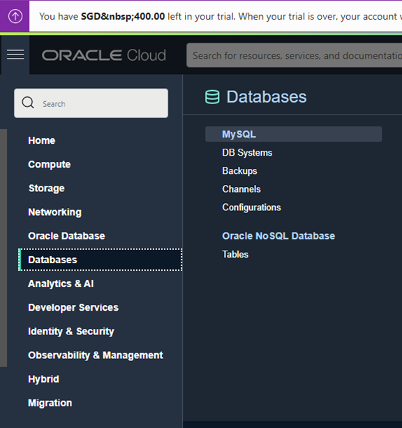
2. Menekan Tombol Create MySQL Database
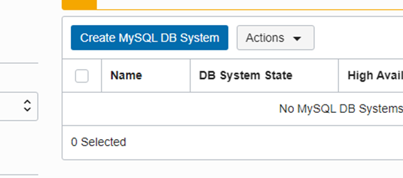
3. Mengisi Compartment dan Jenis Database
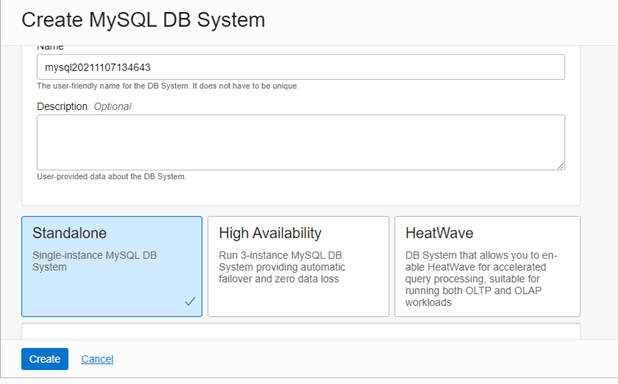
4. Mengisi Data Databases Administrator
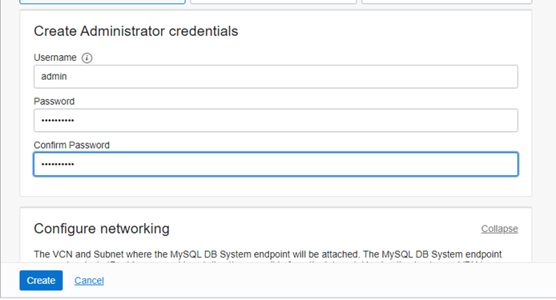
5. Mengkofigurasi VCN 
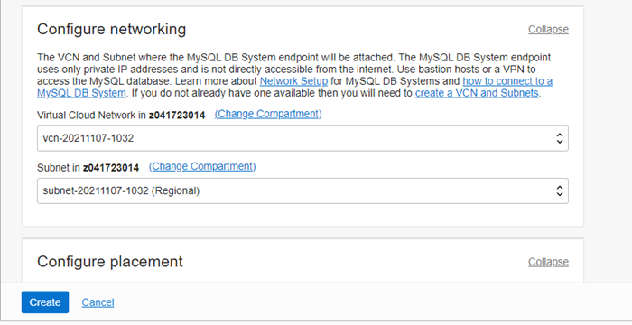
6. Mengkofigurasi Availability Domain 
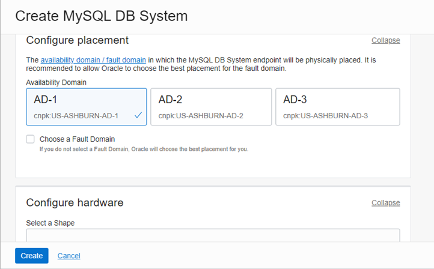
7. Mengkofigurasi Shape dari Database
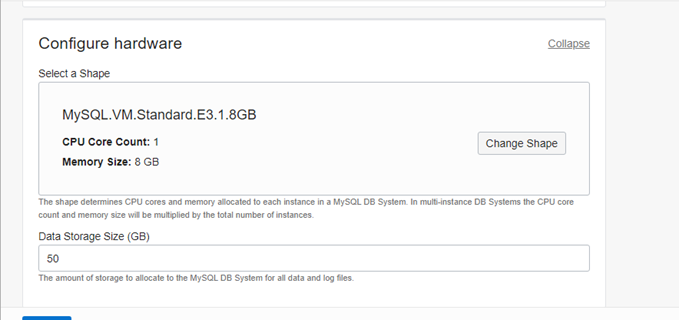
8. Mengkofigurasi Backup dari Database dan Menekan Tomboh Create Database.
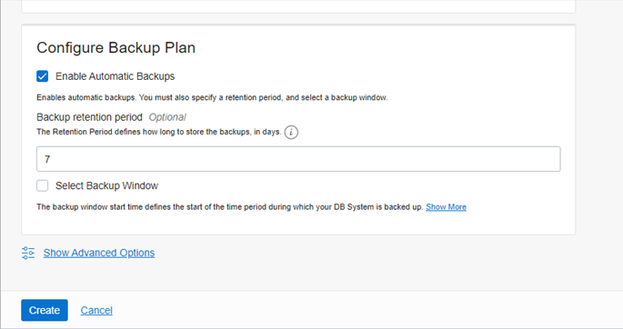
Setelah menekan tombol create database maka status database adalah Creating, jadi tunggulah beberapa saat sampai status database
Active
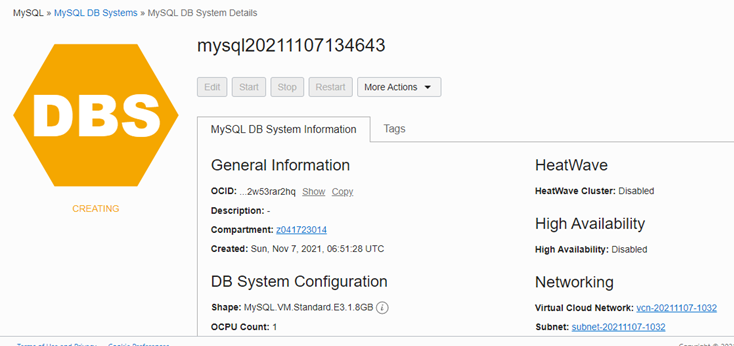
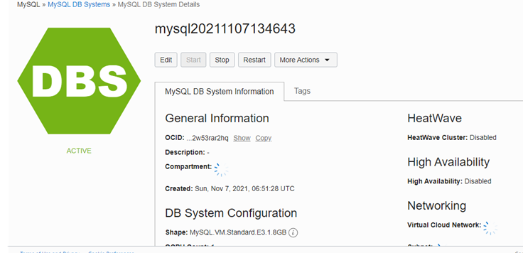

##### Konfiguarasi VCN

1. Memilih menu VCN pada Networking
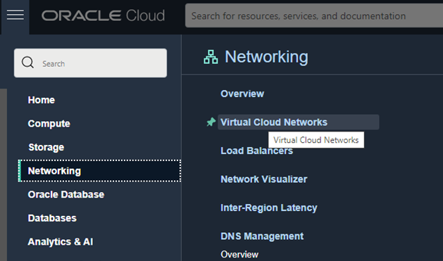
2. Memilih menu Security List
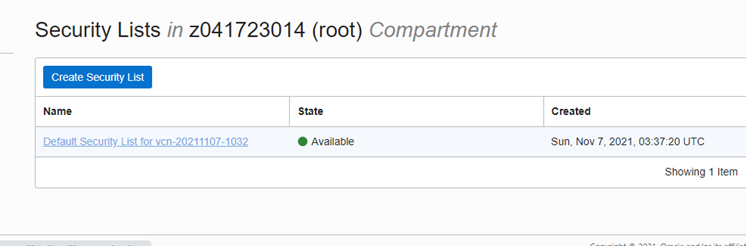
3. Menambah Rules pada Security List
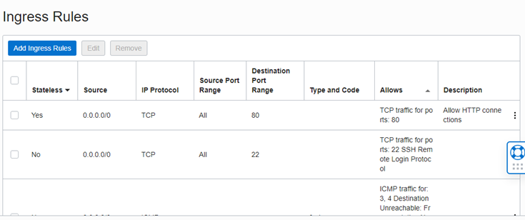
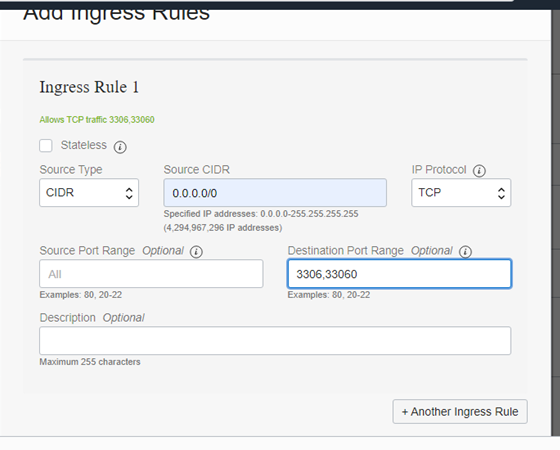

#### mengakses mySql Melalui SSH

1. Cara untuk mengakses instances yang dimiliki melalui ssh adalah dengan mengetik perintah
sudo ssh -I <path private key> username@ip public

2. Mengakses MySQL
Setelah berhasil masuk ke instances yang dimiliki anda dapat mengakses mysql anda akan tetapi
anda harus menginstall mysql client. Jika anda tidak memiliki mysql client maka anda akan
mendapat pesan seperti berikut

* Untuk mengkoneksikan mysql dengan perintah berikut mysql -u <database administrator> -p -h <ip
private mysql oci /hostname>. Setelah ini database sudah siap untuk digunakan sesuai dengan
kebutuhan anda

#### Install Wordpress Pada PaaS

1. Membuat Database

* mysql> create database wordpress;
* mysql> show databases;
* mysql> grant all privileges on wordpress.* to admin;

2. Download Wordpress Pada Folder /var/www/html dengan perintah 
wget https://wordpress.org/latest.tar.gz;

3. Mengetrak Wordpress Pada Folder /var/www/html dengan perintah
tar zxvf latest.tar.gz
4. a menginstall extension mysql pada php dan mengaktifkannya pada php.ini.
Berikut adalah perintah untuk menginstall extenstion mysql pada php.
sudo apt-get install php-mysql

5. Selanjutnya Proses Intalasi Wordpress Melalui Browser

