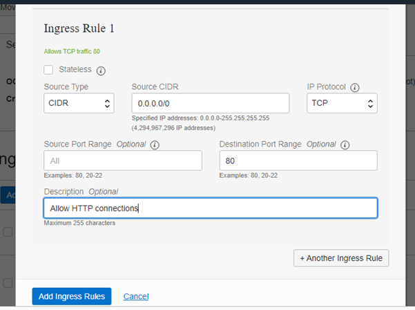

# Jobsheet 4

### VCN

### praktikum 1
1. login ke akun Oracle Cloud Anda masing-masing melalui tautan ini
https://www.oracle.com/cloud/sign-in.html

2. Setelah berhasil login dan ada di beranda Oracle Cloud akun Anda, silakan pilih
menu di pojok kiri atas, lalu pilih menu Networking > Virtual Cloud Networks

3. Pastikan VCN sudah ada, biasanya jika berhasil telah membuat VM dari modul
pertemuan sebelumnya maka VCN akan tampil di sini. Silakan klik nama VCN tersebut.

4. Pilih Security Lists di panel kiri (Resources), lalu pilih Default Security List di
tabel yang tersedia.

5. Klik tombol biru Add Ingress Rules untuk menambahkan port.
* Isilah ingress rule dengan nilai-nilai seperti gambar di atas atau teks berikut:
Stateless: Checked
Source Type: CIDR
Source CIDR: 0.0.0.0/0
IP Protocol: TCP
Source port range: (biarkan kosong)
Destination Port Range: 80
Description: Allow HTTP connections
* Terakhir, klik tombol Add Ingress Rules. Sekarang koneksi HTTP telah diizinkan. VCN Anda
telah dikonfigurasi untuk Apache server.
Anda telah sukses membuat ingress rule yang berfungsi untuk membuka port 80 HTTP server
VM Anda agar bisa diakses oleh publik.

### praktikum 2
1. Buka instance Anda melalui menu Compute > Instances, kemudian copy IP public
VM yang ingin kita akses untuk diatur web server Apache.

2.  Lakukan akses ke VM atau server kita dengan perintah berikut ini. ssh -i "private.key" ubuntu@140.83.56.4

3. Setelah terkoneksi dengan VM Anda, silakan lakukan perintah berikut baris
demi baris untuk menginstall Apache server.

* sudo apt update
* sudo apt -y install apache2

4. Jalankan service Apache dengan perintah berikut.
* sudo systemctl restart apache2

5. Secara default pada VM Ubuntu kita untuk firewall itu statusnya disabled (tidak
aktif), maka kita perlu mengaktifkannya dengan melakukan update pada iptabels terlebih
dahulu. Lakukan perintah berikut baris demi baris.

* sudo iptables -I INPUT 6 -m state --state NEW -p tcp --dport 80 -j ACCEPT
* sudo netfilter-persistent save

6. Sekarang Anda dapat melakukan uji server VM Anda dengan perintah curl
localhost atau buka browser di komputer/laptop pribadi Anda dan arahkan ke IP public
VM yang Anda miliki. Seharusnya jika sukses, maka akan tampil seperti gambar berikut ini.

#### praktikum 2

#### Tugas
Buatlah laporan praktikum 1 dan 2 tersebut! Jika ada error atau kesalahan, bagaimana cara
Anda menemukan solusinya?
